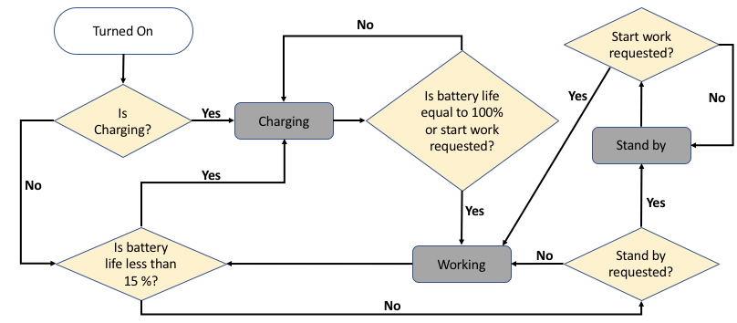

# Bots Functionality

A bot can have 3 statuses:

1. **standby:** Fully charged, on the dock waiting to work.
2. **charging:** Battery life is less than 100%, on the dock, charging.
3. **working:** Means that the bot is doing something. The bots are programmed to only work if their battery life is bigger than 15%. Whenever its battery life reaches 15%, a bot will automatically go to its charging dock to charge.

A bot will always go to the charging dock to charge whenever it reaches 15% of battery life. Unless explicitly requested, the bot will not go back to work while charging, until its battery is 100% charged. 

Once charged, the bot goes automatically back to work, unless explicitly requested to standby. In that case, it will be on stand by mode on the charging dock, without draining battery.

Whenever a bot is working, it will start draining its battery, until it reaches 15%. At this point, the bot will automatically go back to the charging dock for charging.

Currently we have two bots versions, and the table bellow illustrates the difference between both:

|Functionality | Version | Description                         |
|--------------|---------|-------------------------------------|
|Battery Life  |1.0      | 5 mins                              |
|              |2.0      |10 mins                              |
|Charging Time |1.0      |60 seconds                           |
|              |2.0	     |30 seconds                           |
|Telemetry     |1.0	     |Sends 1 datapoint every 15 seconds.  |
|              |2.0      |Sends 15 datapoints every 15 seconds.|