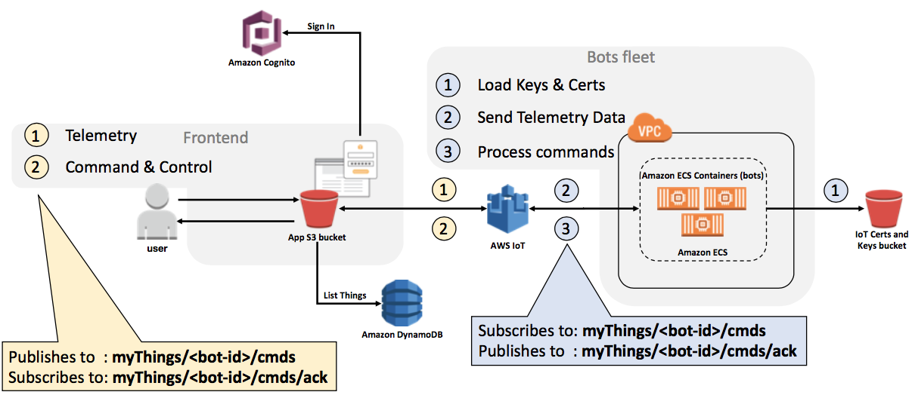
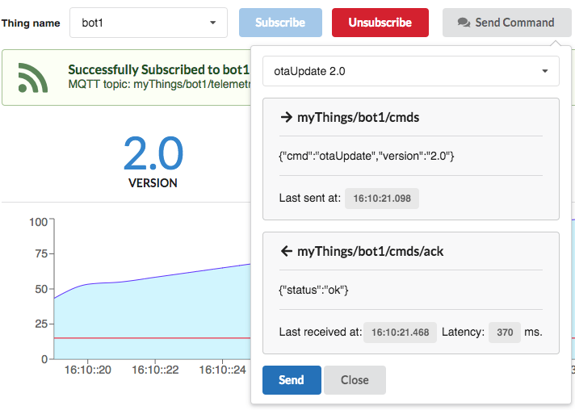

## Controlling Bots
Bots can be controlled remotely. They listen for commands on a specific MQTT topic and send the response to those commands on another MQTT topic.  The table bellow describes it in more details:

|Entity |Topic                  |Description          |
|-------|-----------------------|---------------------|
|WebApp	|`myThings/<botId>/cmds`|Publishes commands.  |
|       |`myThings/<botId>/ack `|Listen for responses.|
|Bot    |`myThings/<botId>/cmds`|Listen for commands. |
|       |`myThings/<botId>/ack `|Publishes responses. |

You can send the following commands to the bots:

1. **otaUpdate:** Update the bot software to version 1.0: Updates the software to version 1.0.
2. **otaUpdate:** Update the bot software to version 2.0: Updates the software to version 2.0.
3. **Start Work:** Request the bot to go to work immediately.
4. **Stand by:** Request the bot to go to stand by mode immediately.

The picture bellows illustrates how you can send those commands to a specific bot within the web front-end.

