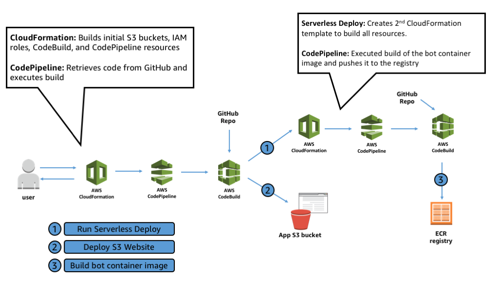

# Installing Acme Bots

Acme bots was built using the serverless application framework using Node.js and React.  The serverless framework was retained in the overall deployment methodology.  CloudFormation and CodePipeline are included to simplify provisioning for the end user.  Below is a diagram showing the installation workflow: 

Services Used: 

 * [AWS Lambda](https://aws.amazon.com/lambda/) provides logic for Acme Bots without requiring servers 
 * [AWS Step Functions](https://aws.amazon.com/step-functions/) provides serverless workflows to tie together multiple Lambda functions to meet the needs of Acme Bots
 * [AWS IoT Core](https://aws.amazon.com/iot-core/) allows Acme bots to securely connect and track IoT bots while also making it easy for other services to gather and act on data generated from the devices
 * [Amazon DynamoDB](https://aws.amazon.com/dynamodb/) provides a serverless database used for tracking metadata about IoT Bots 
 * [Amazon Cognito](https://aws.amazon.com/cognito/) provides sign in and access control for the Acme Bots Front end Web Application
 * [Amazon S3](https://aws.amazon.com/s3/) hosts the Acme Bots Static front end website as well as build artifacts
 * [AWS Fargate](https://aws.amazon.com/fargate/) hosts our IoT bots in lieu of having physical bots
 * [AWS CodePipeline](https://aws.amazon.com/codepipeline/) provides a pipeline for managing our build from code.
 * [AWS CodeBuild](https://aws.amazon.com/codebuild/) executes serverless deploy and bot container builds 
 * [AWS CloudFormation](https://aws.amazon.com/cloudformation/) allows deploying infrastructure (Infrastructure-as-Code)

[Amazon CloudWatch](https://aws.amazon.com/cloudwatch/) is used for monitoring our application as follows:

 * Metrics track bot low battery, event delays, and battery threshold
 * Alarms send notifications based on bot low battery or telemetry delays
 * Events are used for publishing bot status
 * Logs are used to gain insight into execution

## Installation

Installation includes provisioning a VPC and all related components for this solution.  To install Acme bots you must have a GitHub account with a personal access token.

* Sign up for a [GitHub](https://github.com) account if you do not have one
* Setup a personal access token as described [here](https://help.github.com/articles/creating-a-personal-access-token-for-the-command-line/)
 * For scopes, check *repo* and it's child scopes.  Also check *read:repo_hook*.  
 * Click *Generate Token*.  Record the token as you'll need it for deployment.
* Fork this GitHub repo into your own account
* Right click on the *acme-bots.template*, *Save link as* and save to your computer
* In the AWS Console, go to *CloudFormation* and *Create Stack*.  
* Select upload a template to S3, click *Browse*, and select your copy of acme-bots.template.  Click *Next*
* Fill in the form (example below)
 * Stack Name: acmebots
 * User Name: acmebotsadmin
 * Email: my@example.com (This must be a valid email as it sends you the login password)
 * Stage: dev
 * GitHub OAUTH Token: ...  				The personal access token above
 * GitHub User: mygithubuser				The name of your user in GitHub
 * GitHub repo: aws-iot-core-acmebots-monitoring	The name of your forked repo
 * GitHub branch: master
* Click *Next*
* On the *Options* page, click *Next* again
* Check *I acknowledge that AWS CloudFormation might create IAM resources with custom names* and click *Create*

Deployment takes around 25 minutes including both CodePipeline runs 

## Verifying Deployment 
* In the AWS Console, in CloudFormation, you should see 2 stacks in CREATE_COMPLETE
** First, the stackname you used above (acmebots).  
** Second, a stack called acme-bots-<stage> (acme-bots-dev) 
* In the AWS Console, go to CodePipeline.  You should see 2 pipelines (acmebots-dev and acme-bots-botpipeline-dev).  Confirm each of these has successfully completed 
** acmebots-dev (<stackname>-<stage>) - Runs our serverless template to create lambda functinos, IoT resources, S3, CodeBuild, etc.  This is what creates the acme-bots-<stage> CloudFormation stack 
** acme-bots-botpipeline-dev - Runs the build of our bot code and pushes the docker image to our Elastic Container Registry (ECR) 

