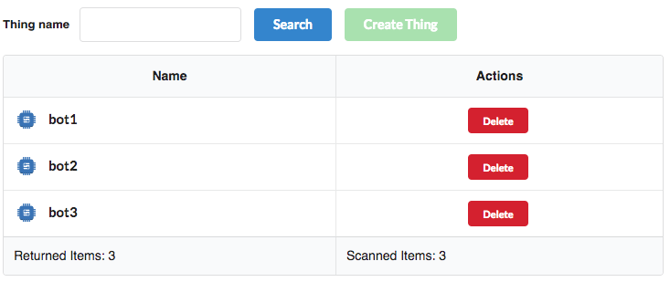
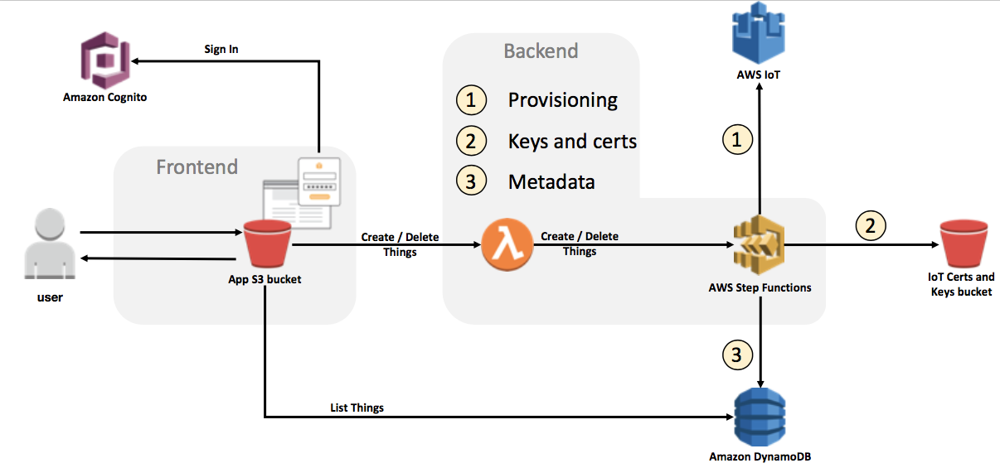
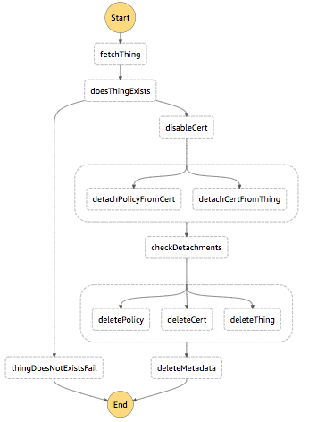

## Provisioning Bots
Before you use a bot, it needs to be properly configured on the AWS IoT platform. Our app has a screen just for searching, creating and removing things.

* To provision a bot, you need to connect to the web front-end in your browser.  You can find the URL in the Outputs tab (WebsiteURL) for the stack you created (acmebots if you used the default stack name in these directions).  
* The user name and password to connect to this site will be in an email sent to the address you provided during stack creation.  Authenticate to the web site (Cognito) using this user/password.  You will have to change your password and enter a verification code from email to continue.  
* The provisioning frontend GUI looks like this: 
  
* Go to the 'Things' tab.  Type in a bot name and click 'Create Thing'.  In the demo we created bot1, bot2, and bot3.  
* Clear the thing name from the box and click 'Search'.  You should see the bots you provisioned.  

The process of provisioning is shown below:

This consists of:

1. Provision the necessary entities on AWS IoT
    1. Create a thing
    2. Create a certificate.
    3. Create an IoT policy.
2. Group the entities together on AWS IoT:
    1. Attach the thing to the cert.
    2. Attach the cert to the policy.
3. Save the meta data on DynamoDB so we can query it. We use DynamoDB here because the AWS IoT API has a limit on how many API calls you can do per second.
4. Save the keys and certs to S3, since AWS IoT just give us that information once, right after we create the certificate. The certs would be needed later on for the bots to connect to AWS IoT.
5. Provision the bot on AWS Fargate.  

The picture bellow shows the AWS StepFunctions state machine for the provisioning process:

The removing process consists of:
1. Disable the certificate use by the thing being removed.
2. Detach the entities:
    1. Detach the thing from the certificate.
    2. Detach the certificate from the policy.
3. Delete entities from AWS IoT:
    1. Delete the thing.
    2. Delete the certificate.
    3. Delete the policy.
4. Delete the corresponding data:
    1. Delete the meta data from the DynamoDB table.
    2. Delete the certs and keys from the S3 bucket.

The picture bellow shows the AWS StepFunctions state machine for the removing process:

