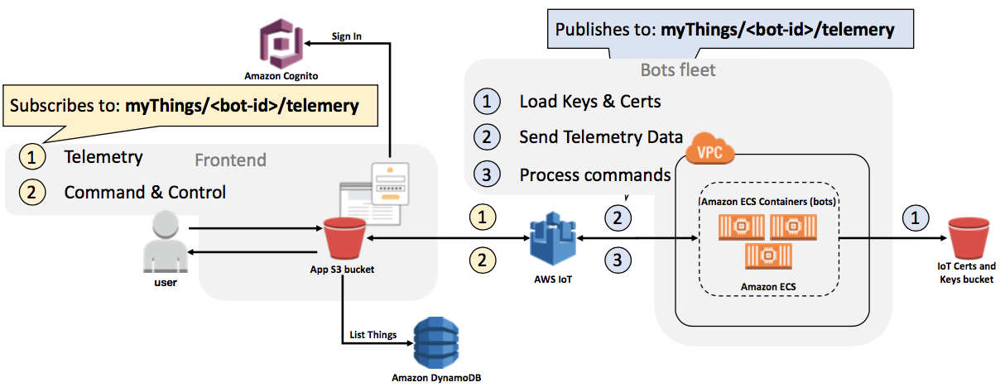
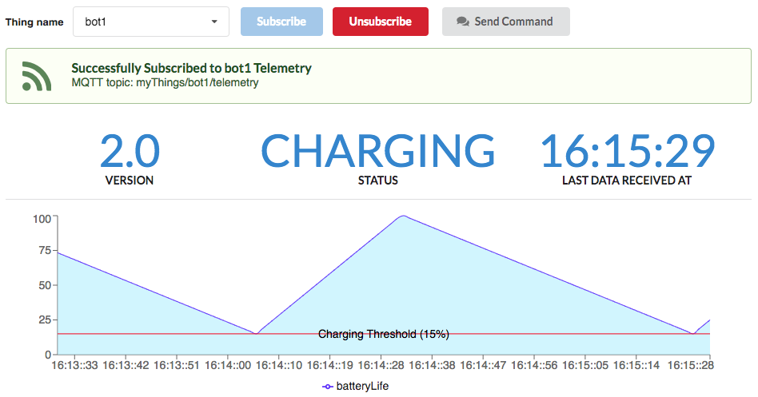

## Viewing Bot's Telemetry
Once a bot is provisioned and operational, we can use the web front-end to see its telemetry in real-time. 

This is how the frontend GUI looks like:

A bot sends the following telemetry information, every 15 seconds:

1. **Version:** The software version it is currently running.
2. **Status:** The bot status.
3. **Battery Life:** The current battery life, in percentage.

**Note:** The app does not fetch any historical data. All it does is to subscribe to the respective thing topic and wait for telemetry being sent by the bot every 15 seconds. So, whenever you subscribe to a bot, it can take up to 15 seconds to receive the first telemetry data. If you keep subscribed, the data will be automatically updated every 15 seconds.
